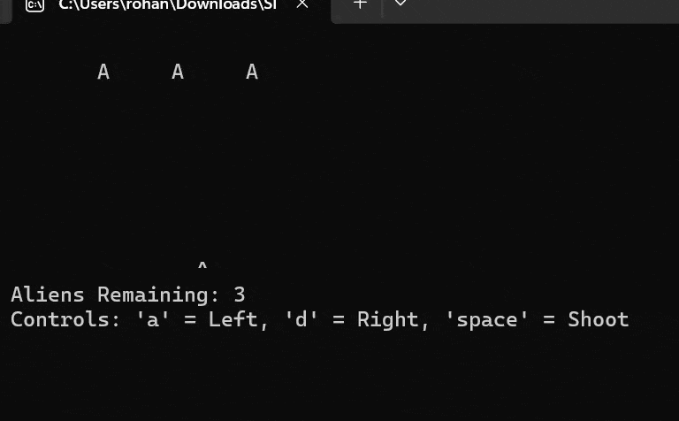

# space-invaders-c

A terminal-based version of the classic arcade game Space Invaders clone written in C, which implements real-time input with `select()`, a custom game loop, and basic collision detection.

I created this as an early project focused on how low-level system calls can be used to build interactive applications in a console environment.

## Demonstration




## Features

* Real-time input handling using `select()` for non-blocking keyboard input
* Custom game loop with controlled timing for smooth terminal gameplay
* Dynamic enemy movement with boundary detection and directional switching
* Collision detection system between player projectiles and enemies
* Lightweight rendering using a 2D character buffer (`gameField`)
* Single active projectile system to manage shooting state efficiently


##  How to Run
### Requirements

* GCC compiler
* Unix-like environment (Linux, macOS, or WSL on Windows)


### Steps

```bash
git clone https://github.com/your-username/space-invaders-c.git
cd space-invaders-c
make
./game
```


### Running on Windows

This project uses Unix-specific system calls (`unistd.h`, `select()`), so it is recommended to run it using:

* **WSL (Windows Subsystem for Linux)**, or
* a Linux/macOS environment

Running directly via Windows compilers may require modifications.


## Game Controls

* `a` → Move left
* `d` → Move right
* `space` → Shoot


## Project Structure

```
space-invaders-c/
│── src/
│   └── main.c        # Core game logic
│── Makefile          # Build configuration
│── README.md
│── .gitignore
```


## Future Improvements

* Add cross-platform input handling (remove Unix dependency)
* Introduce multiple enemy types and levels
* Implement scoring persistence
* Refactor into modular components (separate game logic, rendering, input)


