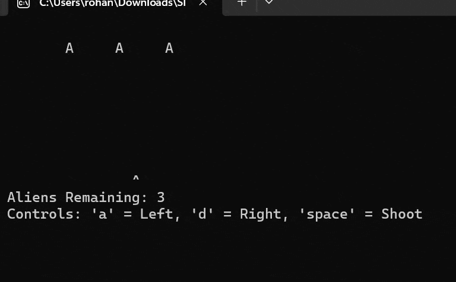

# space-invaders-c

A terminal version of Space Invaders written in C. It runs a fixed-tick game loop, reads the keyboard without blocking using `select()`, and draws the game from a 2D character buffer.

I built this as an early project to learn how low-level POSIX calls (terminal settings, `select()`, `read()`) can be used to make an interactive program in a plain console.

## Demonstration



## How it works

* **Input:** the terminal is switched out of line-buffered mode with `termios` (`ICANON` and `ECHO` off), so each key press arrives immediately. The original settings are restored on exit, including on Ctrl+C.
* **Game loop:** each tick draws the screen, moves the aliens, moves the bullet, then waits up to 500 ms for a key with `select()` so the loop never stalls.
* **Rendering:** the game is drawn into `gameField[HEIGHT][WIDTH]` and printed each frame after an ANSI clear-screen sequence.
* **Aliens:** move as a formation; when any alien would leave the grid, they all reverse and drop one row. You lose if one reaches the bottom row.
* **Shooting:** one bullet at a time. A hit is detected whether the bullet moves into an alien or an alien moves into the bullet. Each alien is worth 10 points.

## How to run

### Requirements

* GCC and `make`
* A Unix-like environment (Linux, macOS, or WSL on Windows)

### Steps

```bash
git clone https://github.com/rohanchennupati-sudo/space-invaders-c.git
cd space-invaders-c
make
./game
```

### Running on Windows

The game uses POSIX headers (`unistd.h`, `termios.h`, `sys/select.h`), so run it in WSL or on Linux/macOS. Native Windows would need a different input layer (for example `conio.h` or PDCurses).

## Controls

* `a`: move left
* `d`: move right
* `space`: shoot
* `q`: quit

## Project structure

```
space-invaders-c/
├── src/
│   └── main.c        # game logic, rendering and input
├── assets/
│   └── demo.gif
├── Makefile
├── README.md
└── LICENSE
```

## Possible improvements

* A fixed timestep, so the game speed doesn't change while keys are pressed
* Split into separate files for input, game logic and rendering, with a `GameState` struct instead of globals
* More enemy types, alien bullets and levels
* Saving a high score
